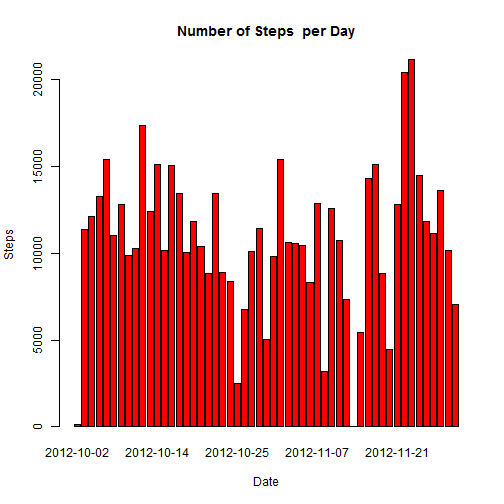
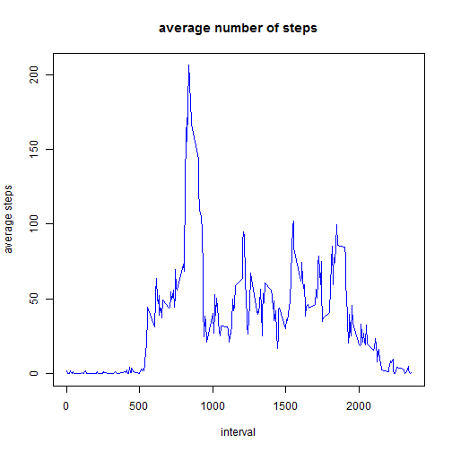
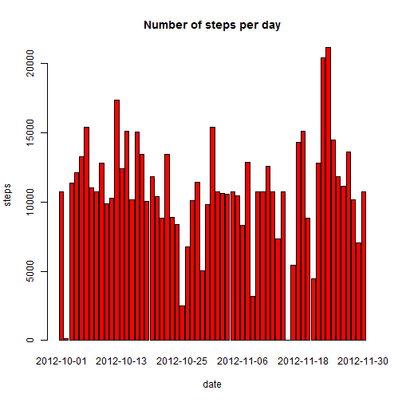
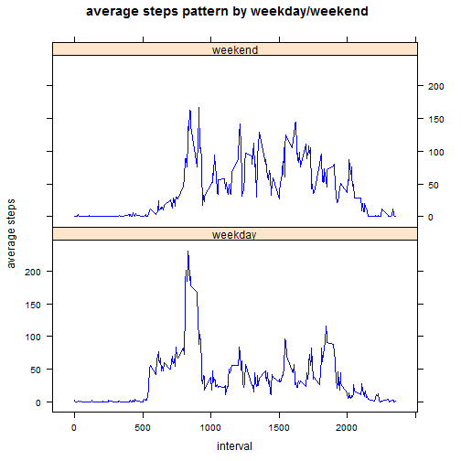

<<<<<<< HEAD
## Reproducible Research: Peer Assessment 1

### Loading and preprocessing the data


```r
activity<-read.csv("activity.csv" , header=TRUE)
head(activity)
```

```
##   steps       date interval
## 1    NA 2012-10-01        0
## 2    NA 2012-10-01        5
## 3    NA 2012-10-01       10
## 4    NA 2012-10-01       15
## 5    NA 2012-10-01       20
## 6    NA 2012-10-01       25
```


```r
dim(activity)
```

```
## [1] 17568     3
```


```r
names(activity)
```

```
## [1] "steps"    "date"     "interval"
```


```r
library(lattice)
activity$date<-as.Date(activity$date,format = '%Y-%m-%d')
```


```r
activity<-read.csv("activity.csv" , header=TRUE)
Total_Steps_By_Day <-aggregate(steps~date, data=activity,sum, na.rm=TRUE)
head(Total_Steps_By_Day)
```

```
##         date steps
## 1 2012-10-02   126
## 2 2012-10-03 11352
## 3 2012-10-04 12116
## 4 2012-10-05 13294
## 5 2012-10-06 15420
## 6 2012-10-07 11015
```


### What is mean total number of steps taken per day?


```r
barplot(Total_Steps_By_Day$steps, names.arg =Total_Steps_By_Day$date, main="Number of Steps  per Day",xlab="Date", ylab="Steps", col="red")
```

 


On average, the number of steps taken per day is 1.0766189 &times; 10<sup>4</sup> and the median is 10765 


### What is the average daily activity pattern?


```r
activity<-read.csv("activity.csv" , header=TRUE)
Average_Steps_By_Interval <-aggregate(steps~ interval , data=activity,mean, na.rm=TRUE)
plot(Average_Steps_By_Interval$interval, Average_Steps_By_Interval$steps, type="l",xlab="interval",ylab="average steps", main="average number of steps",col="blue")
```

 


```r
Average_Steps_By_Interval$interval[which.max(Average_Steps_By_Interval$steps)]
```

on average, the 5-minute interval that contains the maximum number of steps is 835


### Imputing missing values


```r
sum(!complete.cases(activity))
```

```
## [1] 2304
```


```r
activity <- merge(activity,Average_Steps_By_Interval, by = "interval", suffixes = c("",".y"))
nas <- is.na(activity$steps)
activity$steps[nas] <- activity$steps.y[nas]
activity_new <- activity[, c(1:3)]
```


```r
steps_per_day<-aggregate(steps ~ date, activity_new, sum)
barplot(steps_per_day$steps, names.arg=steps_per_day$date, xlab="date", ylab="steps", main="Number of steps per day", col="red")
```

 


On average, the number of steps taken per day is 1.0766189 &times; 10<sup>4</sup> and the median is 1.0766189 &times; 10<sup>4</sup>


### Are there differences in activity patterns between weekdays and weekends?


```r
library(lattice)
activity_new$date<-as.Date(activity_new$date,format = '%Y-%m-%d')
activity_new$day <- ifelse(weekdays(activity_new$date) %in%  c("Saturday", "Sunday"),'weekend','weekday')
head(activity_new)
```

```
##   interval    steps       date     day
## 1        0 1.716981 2012-10-01 weekday
## 2        0 0.000000 2012-11-23 weekday
## 3        0 0.000000 2012-10-28 weekend
## 4        0 0.000000 2012-11-06 weekday
## 5        0 0.000000 2012-11-24 weekend
## 6        0 0.000000 2012-11-15 weekday
```


```r
steps_by_interval_and_Daytype<-aggregate(steps~ interval+day,activity_new,FUN="mean") 
head(steps_by_interval_and_Daytype)
```

```
##   interval     day      steps
## 1        0 weekday 2.25115304
## 2        5 weekday 0.44528302
## 3       10 weekday 0.17316562
## 4       15 weekday 0.19790356
## 5       20 weekday 0.09895178
## 6       25 weekday 1.59035639
```


```r
library(lattice)
xyplot(steps ~ interval | day, steps_by_interval_and_Daytype, layout = c(1, 2), type = "l", col="blue", xlab="interval", ylab="average steps", main="average steps pattern by weekday/weekend ")
```

 

     


=======
---
title: "Reproducible Research: Peer Assessment 1"
output: 
  html_document:
    keep_md: true
---


## Loading and preprocessing the data


## What is mean total number of steps taken per day?


## What is the average daily activity pattern?


## Imputing missing values


## Are there differences in activity patterns between weekdays and weekends?
>>>>>>> 80edf39c3bb508fee88e3394542f967dd3fd3270
